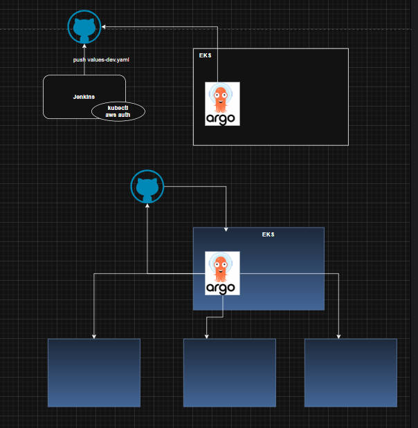
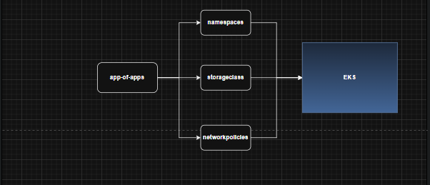
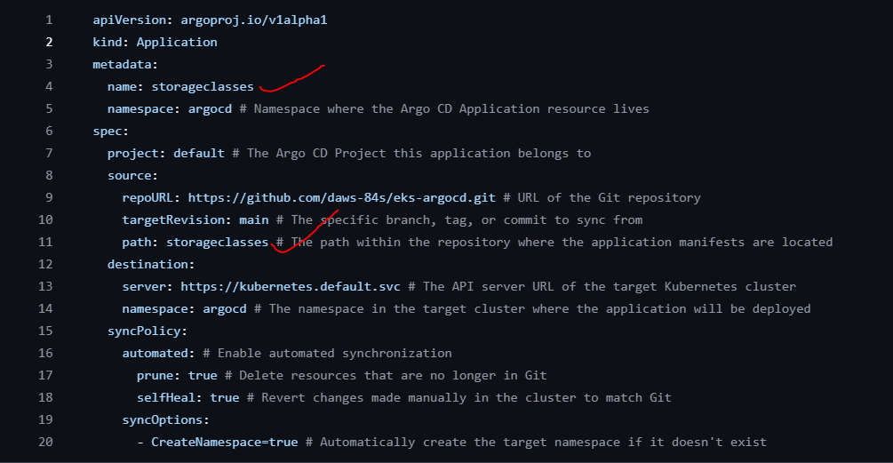
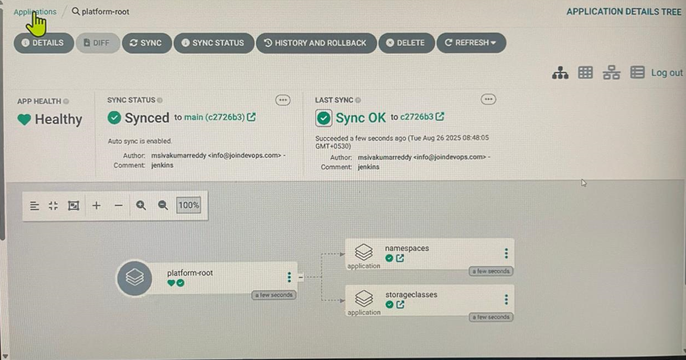

## Understanding Argo CD  Session-83

    Everything in argocd is called as application...

    All the K8s resources like namespaces, storageclasses, network policies, ingress controller drivers, ebs drivers, efs drivers, pv etc can be created by the using the ArgOCD

    As shown in the below image in ArgoCD the target is Git and destination is EKS

    From the above we can understand that we have something called app-of-apps.yaml in the ArgoCD. In which we will have the different resources like namespaces, storageclasses, network policies, ingress controller drivers, ebs drivers etc
    All these are different files inside the app-of-apps.yaml file and we can apply this app-of-apps.yaml at a time, so that all the resorces inside it will be created in the defined destination.

    Below is the example of the storage-class inside the app-of-apps, similarly we will have the namespaces, ebs, etc..

        

 

    Above is the example for how app-of-apps looks inside the cluster (namespaces and storage-class) were created using the ArgoCD

## Installation

    On our bastion host:- 

    kubectl create namespace argocd

    kubectl apply -n argocd -f https://raw.githubusercontent.com/argoproj/argo-cd/stable/manifests/install.yaml

    After this we have to go to the service and change the clusterIP to the LoadBalancer or use the below command to change the service type to LoadBalancer

    kubectl patch svc argocd-server -n argocd -p '{"spec": {"type": "LoadBalancer"}}'

    curl -sSL -o argocd-linux-amd64 https://github.com/argoproj/argo-cd/releases/latest/download/argocd-linux-amd64
    sudo install -m 555 argocd-linux-amd64 /usr/local/bin/argocd
    rm argocd-linux-amd64      >>> this command is for argocd CLI

    Now, in AWS console, check for the loadbalancer and hit it in a browser and we will see the ArgoCD UI

    argocd admin initial-password -n argocd

    take the password and login to the UI and the username is admin

